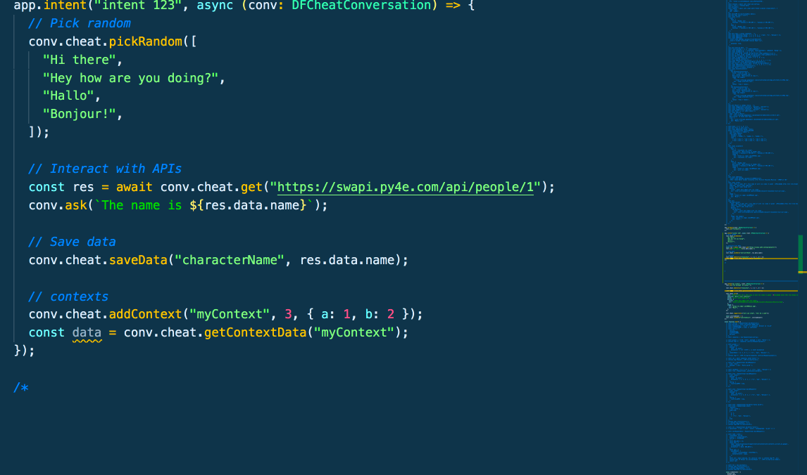

```
tl:dr; So easy it'll make you feel like you're cheating at dialogflow
```

---

**Note:** For the very impatient, go here: **[quickstart.md](./quickstart.md)**

---

## Overview

df-cheatcodes is a library exposing useful aliases, shortcuts, functionality/[sugar](https://en.wikipedia.org/wiki/Syntactic_sugar) that will help teams **quickly** iterate on conversational experiences with DialogFlow.

The big idea is to make it simple and **fast** to quickly iterate on conversational experiences.

Ex. Rich components the fast & easy way (notice no imports):



## Where to start?

- If you've never really used DialogFlow before w/ a team & are starting from scratch, start here & learn the basics: https://github.com/valgaze/dialogflow-speedrun

- If you've already used DialogFlow & have an agent in place-- see the **[quickstart.md](./quickstart.md)** where you can opportunistically use df-cheatcodes feature

- If you need a starter frontend, server, and intent-handlers see the **[df-cheatkit](https://github.com/valgaze/df-cheatkit)** repo for a batteries-included starter example

## Functionality

### aogCheat

- **Details:** **[aogCheat.md](./docs/aogCheat.md)**

_Collection of helpers to augment the actions-on-google and make working with rich components, contexts, data, 3rd-party APIs, and other tasks faster & easier_

### apiCheat

- **Details:** **[apiCheat.md](./docs/apiCheat.md)**

_Helpful items for transacting with the API, can optionally transform gRPC <> JSON for event, request data as required_

## endpointCheat

_Add this to route to handle DialogFlow requests (evnts, text, requestdata, etc) from a frontend or other service_

### requestCheat

- **Details:** **[requstCheat.md](./docs/requestCheat.md)**

_Various helpers to help simplify building requests_

**Libraries**

df-cheatcodes provides cheats using **[actions-on-google](https://www.npmjs.com/package/actions-on-google)** `^2.12.0` & **[dialogflow](https://www.npmjs.com/package/@google-cloud/dialogflow)** `^1.2.0`

## License

This repo uses types & concepts from **[actions-on-google](https://github.com/actions-on-google/actions-on-google-nodejs)** which itself is under apache license. At time of writing, it seemed that clearest/simplest thing to do is match that license in a notice-- accordingly, this repo conforms to the **[Apache 2.0 license](LICENSE)**
